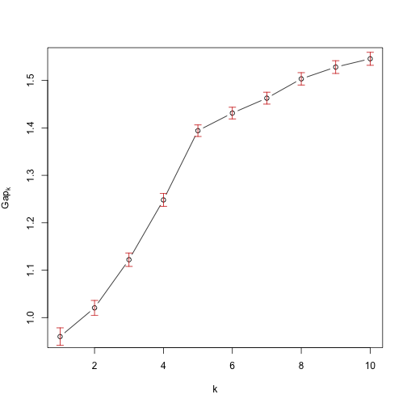
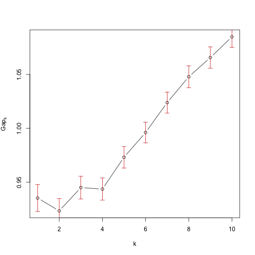
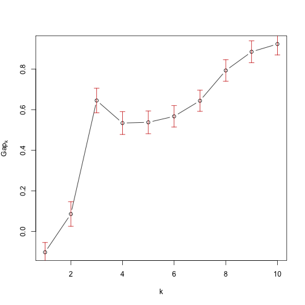
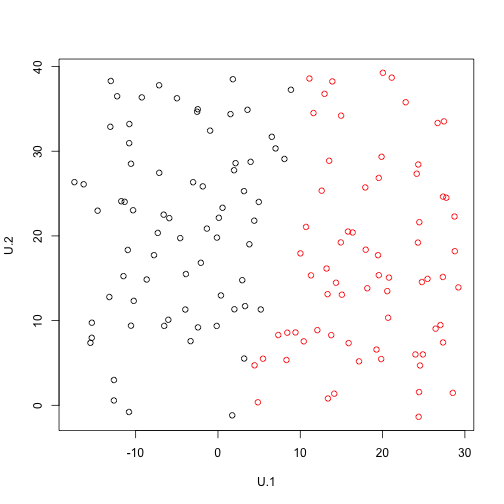
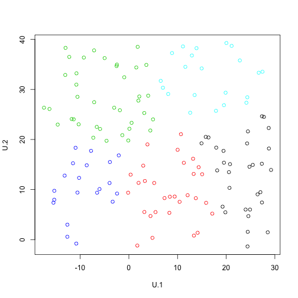
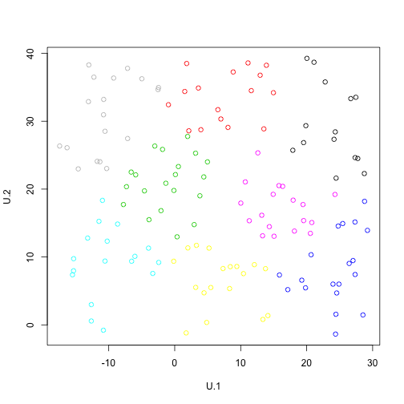
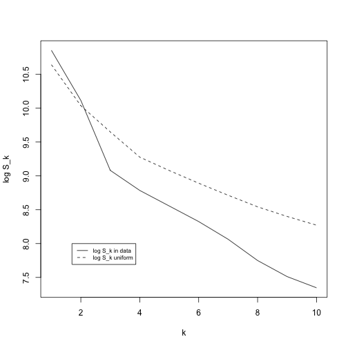

# EXERCISE 1

## a)

```r
library(pdfCluster)
data(oliveoil)
olive= oliveoil[,3:10]
vow=read.table("vowels.dat.txt",header = T)
artdat=read.table("clusterdata2.txt")

diag(var(vow))
```

```
##       x.1       x.2       x.3       x.4       x.5       x.6       x.7       x.8       x.9 
## 0.7551388 1.3812643 0.5068703 0.5764778 0.4416962 0.3646603 0.2133764 0.3286752 0.3250843 
##      x.10 
## 0.3647985
```

```r
diag(var(artdat))
```

```
##       V1       V2 
## 151.0356 221.9646
```

```r
diag(var(olive))
```

```
##    palmitic palmitoleic     stearic       oleic    linoleic   linolenic   arachidic 
##  28423.3515   2755.6583   1350.1903 164681.9365  58951.4616    168.1871    485.3319 
##  eicosenoic 
##    198.3392
```

```r
solive=scale(olive)
```

Looking at the variances of the variables of the first two data sets, they look very similar in terms of scale, so the only data set that needs to be scaled is olive.

## Olive Data

```r
library(cluster)
set.seed(123456)
cg1.olive <- clusGap(solive,kmeans,K.max = 10,B=100,d.power=2,spaceH0="scaledPCA",nstart=100)
```

```
## Clustering k = 1,2,..., K.max (= 10): .. done
## Bootstrapping, b = 1,2,..., B (= 100)  [one "." per sample]:
## .................................................. 50 
## .................................................. 100
```

```r
plot(cg1.olive,main="")
```



```r
#print(cg1.olive,method="globalSEmax",SE.factor=2)

#print(cg1.olive,method="Tibs2001SEmax",SE.factor=3)
```
If we use the "globalSEmax" method for choosing the best number f clusters the suggested value is 9. Looking at the graph we find the elbow of the curve in presence of k=5, using the method "Tibs2001SEmax" with q=3 the suggested number is 6, so we get a more coherent result with the graph iterpretation.


## Vowels Data

```r
library(cluster)
set.seed(123456)
cg1.vow <- clusGap(vow,kmeans,K.max = 10,B=100,d.power=2,spaceH0="scaledPCA",nstart=100)
```


```r
plot(cg1.vow,main="")
```



The "globalSEmax" method suggests 9 clusters, on the other hand "Tibs2001SEmax" suggests just 1 and looking at the graph we immediatly undurstand why: the gap decreases for k=2. We can say that the latter is probably not the best solution, also considering how the gap increases after k=4. 

## Artificial Data Set 2

```r
set.seed(123456)
cg1.art <- clusGap(artdat,kmeans,K.max=10,B=100,d.power=2,spaceH0="scaledPCA",nstart=100)
```

```
## Clustering k = 1,2,..., K.max (= 10): .. done
## Bootstrapping, b = 1,2,..., B (= 100)  [one "." per sample]:
## .................................................. 50 
## .................................................. 100
```

```r
plot(cg1.art,main="")
```


"globalSEmax" suggests 9 as best number of clusters, but maybe in this case the best solution is offered by the "Tibs2001SEmax" method that suggests 3 clusters, where we can find a local maximum of Gap.


## b)

```r
set.seed(123)
U.1<-runif(n=140, min=min(artdat$V1), max=max(artdat$V1))
U.2<-runif(n=140, min=min(artdat$V2), max=max(artdat$V2))

U<-data.frame(U.1,U.2)

set.seed(123)
U.tw <- sapply(1:10, 
              function(k){kmeans(U, k, nstart=100,iter.max = 15 )$tot.withinss})
set.seed(123)
U.clus=sapply(1:10, 
              function(k){kmeans(U, k, nstart=50,iter.max = 15 )$cluster})

set.seed(123)

art.tw=sapply(1:10, 
             function(k){kmeans(artdat, k, nstart=100,iter.max = 15 )$tot.withinss})


plot(U.1,U.2,col=U.clus[,2])
```



```r
plot(U.1,U.2,col=U.clus[,5])
```



```r
plot(U.1,U.2,col=U.clus[,8])
```



```r
plot(1:10,log(art.tw),xlab="k",ylab="log S_k",type="l")
points(1:10,log(U.tw),xlab="k",ylab=" S_k",type="l",lty=2)

legend(1.7,8,c("log S_k in data","log S_k uniform"),lty=1:2,cex=0.7)
```



As we can see in the last graph the gap between the two log S_k increses as the number of clusters increases

# EXERCISE 2 

```r
library(sn)


m1=matrix(, nrow=150,ncol=100)
m2=matrix(, nrow=150,ncol=100)
for (i in 1:100){

v1 <- c(rnorm(50,0,1), rsn(70,5,1,8), rnorm(30,6,1))
v2 <- c(rnorm(50,0,1), rsn(70,0,1,8), 8+rt(30,5))
m1[,i]=v1
m2[,i]=v2
}
```
The 100 data sets are generated, the values of the two variables are stored in two different matrices (m1 and m2) 


```r
kmax=10

clus.PCA = list()
clus.original=list()
pb=txtProgressBar(min=0,max=100,style=3)
```

                                                                              

```r
set.seed(123)
for(i in 1:100){
  clus.PCA[[i]]=clusGap(cbind(m1[,i],m2[,i]),kmeans,K.max = kmax,B=100,d.power=2,spaceH0="scaledPCA",nstart=100,verbose = F)
  clus.original[[i]]=clusGap(cbind(m1[,i],m2[,i]),kmeans,K.max = kmax,B=100,d.power=2,spaceH0="original",nstart=100,verbose = F)
  setTxtProgressBar(pb,i)
}  
```

The clusGap algorithm is run for the 100 data sets using spaceH0 equal to "scaledPCA" and "original"


```r
gap.PCA=list()
for(i in 1:100){
  gap.PCA[[i]]=clus.PCA[[i]]$Tab[,3]
}


sd.PCA=list()
for(i in 1:100){
  sd.PCA[[i]]=clus.PCA[[i]]$Tab[,4]
}
```

The values for Gap(k) and the var(Sk(U)) in the case of spaceH0="scaledPCA" are saved for the 100 data sets in gap.PCA and sd.PCA respectively.


```r
gap_diff.tib= function(x,y,q){
  n=length(x)
  diff=c()
  for (i in 2:n){
    diff[i]=x[i-1]-(x[i]-q*y[i])
  }
  return(diff[-1])
}

gap.difftib.PCA=sapply(1:100, 
                function(i){gap_diff.tib(gap.PCA[[i]],sd.PCA[[i]],2)})
```
Here I created a function that computes Gap(k)-(Gap(k+1)-q*s(k+1)) 


```r
number.clusters=function(x,kmax){
  b=kmax-1
  for (i in 1:b){
    if(x[i]>0){
      
      a=i
      break
      
    } else{
      a=kmax
    }
  }
  return(a)
}

number_clusters.tib.PCA=sapply(1:100, 
                               function(i){number.clusters(gap.difftib.PCA[,i],kmax)})
```
In this step the suggested number of clusters is computed for each datset according to the "Tibs2001SEmax" method and saved in number_clusters.tib.PCA


```r
gap_diff.global= function(x,y,q){
  n=length(x)
  diff=c()
  for (i in 1:n){
    if (max(x)==x[i]){
      m=i
    }
  }
  for (i in 2:n){
    diff[i]=x[i-1]-(x[m]-q*y[m])
  }
  return(diff[-1])
}

gap.diffglob.PCA=sapply(1:100, 
                       function(i){gap_diff.global(gap.PCA[[i]],sd.PCA[[i]],1)})

number_clusters.global.PCA=sapply(1:100, 
                               function(i){number.clusters(gap.diffglob.PCA[,i],kmax)})


#####original

gap.original=list()
for(i in 1:100){
  gap.original[[i]]=clus.original[[i]]$Tab[,3]
}


sd.original=list()
for(i in 1:100){
  sd.original[[i]]=clus.original[[i]]$Tab[,4]
}

gap.difftib.original=sapply(1:100, 
                       function(i){gap_diff.tib(gap.original[[i]],sd.original[[i]],1)})


gap.diffglob.original=sapply(1:100, 
                        function(i){gap_diff.global(gap.original[[i]],sd.original[[i]],1)})

number_clusters.global.original=sapply(1:100, 
                                  function(i){number.clusters(gap.diffglob.original[,i],kmax)})


number_clusters.tib.original=sapply(1:100, 
                               function(i){number.clusters(gap.difftib.original[,i],kmax)})


table(number_clusters.tib.original)
```

```
## number_clusters.tib.original
##  1  3 
##  8 92
```

```r
table(number_clusters.global.original)
```

```
## number_clusters.global.original
##  3  4 
## 98  2
```

```r
table(number_clusters.tib.PCA)
```

```
## number_clusters.tib.PCA
##  1  3 
## 99  1
```

```r
table(number_clusters.global.PCA)
```

```
## number_clusters.global.PCA
##  3  4 
## 98  2
```
For this last part of the code I avoided explaining everything because I proceeded in an analogous way.
Looking at the tables we can understand which setting of the clusGap algorithm is better at predicting the correct number of cluster, knowing that the correct number of cluster is 3 by the way we generated the data:

-"Tibs2001SEmax" paired with "original": we get 97% of the time the number of clusters are correctly predicted.

-"Tibs2001SEmax" paired with "scaledPCA": 5% of the time the number of clusters are correctly predicted.

-"globalSEmax" paired with "original": 100% of the time the number of clusters are correctly predicted

-"globalSEmax" paired with "scaledPCA": 100% of the time the number of clusters are correctly predicted

So we can conclude that for this kind of data, the better way to infer the correct number of clusters is to use the "globalSEmax" without any distinction from  "original" and "scaledPCA". We have to remind that in this case we had well separeted clusters and in other cases the "Tibs2001SEmax" method might be more helpful


# Exercise 3 

Considering the correlation dissimilarity as  d(x,z)= 1 - abs(cor(x,z)) in order to find a counter example we can do as follows:

d(x,y) <= d(x,z) + d(y,z) this is the triangle inequality and we can rewrite this as

      1 - abs(cor(x,y)) <= 1 - abs(cor(x,z)) + 1 - abs(cor(y,z))
      abs(cor(x,z)) + abs(cor(y,z)) <=  abs(cor(x,y))

In order to find the counter example we can make the right side of the inequality as small as possible, by generating x and y such that they are indipendent. To make the left side of the equation as large as possible we can generate z as z = x + y.


```r
library(MASS)
set.seed(123)
cor.dis <- function(a,b){1 - abs(cor(a,b))}

Sigma    <- matrix(c(1,0,0,1), nrow=2) 
matrixXZ <- mvrnorm(n=100, mu=c(0,0), Sigma=Sigma)
X <- matrixXZ[,1] 
Y <- matrixXZ[,2]

cor(Y,X)
```

```
## [1] 0.04953215
```

```r
cor.dis(Y,X)
```

```
## [1] 0.9504679
```

```r
Z <- X + Y

cor.dis(X,Z) 
```

```
## [1] 0.2569669
```

```r
cor.dis(Y,Z)
```

```
## [1] 0.2947628
```

```r
cor.dis(X,Y) <= cor.dis(Z,Y) + cor.dis(X,Z)
```

```
## [1] FALSE
```

The inequality returns "FALSE" so we found a counter example

```


